# Xtrm

An extremely borderless mechanical keyboard PCB. 40% staggered layout with an encoder, runs [QMK firmware](https://github.com/myst729/qmk_firmware/tree/master/keyboards/dg/xtrm).

## Tools

| Tool                              | Picture                    |
| --------------------------------- | -------------------------- |
| Soldering Iron (936)              | 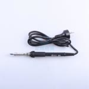 |
| Soldering Wire (Sn63/Pb37, 0.8mm) | 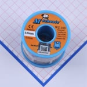 |
| Soldering Flux                    | 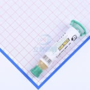 |

## Materials

| Material         | Label               | Quantity | Picture                                   |
| ---------------- | ------------------- | -------- | ----------------------------------------- |
| ATmega32U4-AU    | U1                  | 1        | 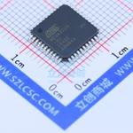   |
| PRTR5V0U2X       | U2                  | 1        | 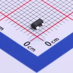       |
| 16MHz Crystal    | X1                  | 1        | 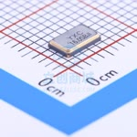   |
| Type-C Connector | CN1                 | 1        | 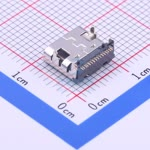          |
| 500mA Fuse       | F1                  | 1        | 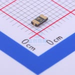      |
| 3mm LED          | LED1                | 1        | 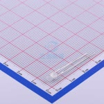         |
| 10KΩ Resistor    | R3, R4, R6, R7, R10 | 5        | 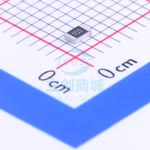   |
| 5.1KΩ Resistor   | R2, R5              | 2        | 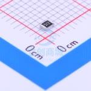  |
| 1KΩ Resistor     | R1, R11             | 2        | 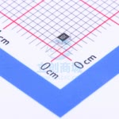    |
| 22Ω Resistor     | R8, R9              | 2        | 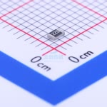    |
| 1uF Capacitor    | C6                  | 1        | 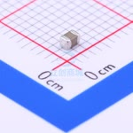   |
| 470nF Capacitor  | C1                  | 1        | 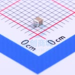 |
| 100nF Capacitor  | C2, C3, C4, C5      | 4        | 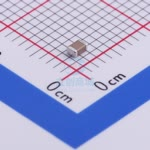 |
| 10nF Capacitor   | C7, C8              | 2        | 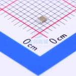  |
| 22pF Capacitor   | C9, C10             | 2        | 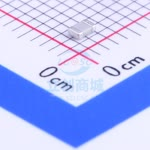  |
| 1N4148 Diode     | D1-D43              | 43       | 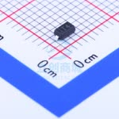    |
| EC11 Encoder     | SW24                | 1        | 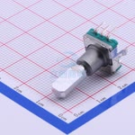    |
| 3x6x2.5 Switch   | KEY1                | 1        | 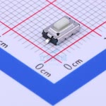  |

## Pictures

